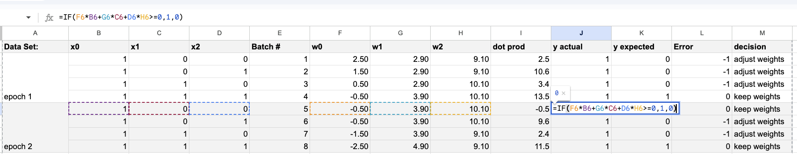
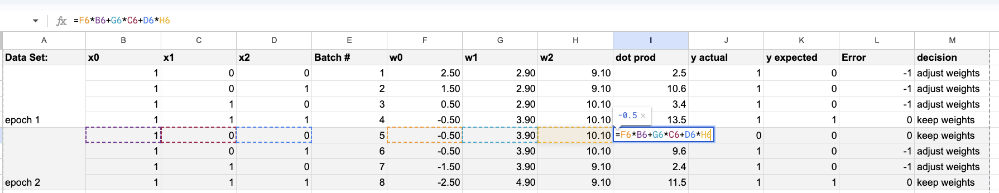
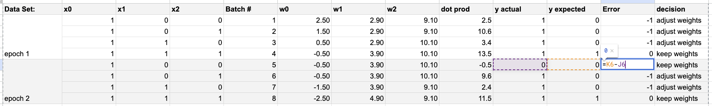
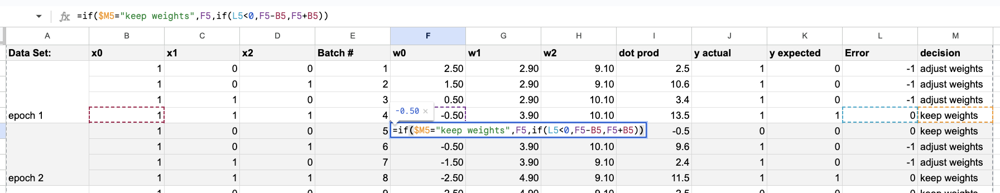
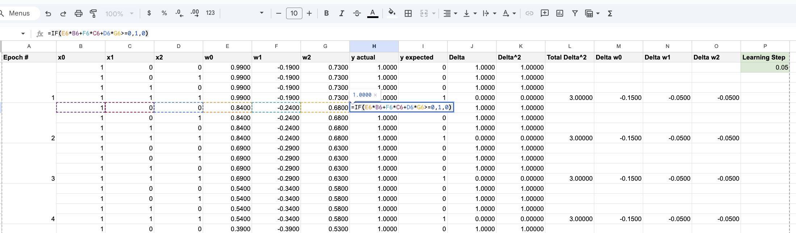
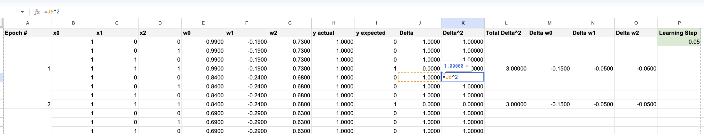
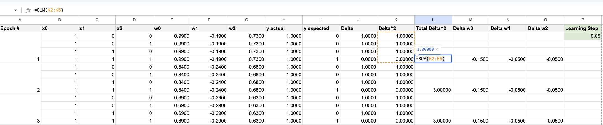
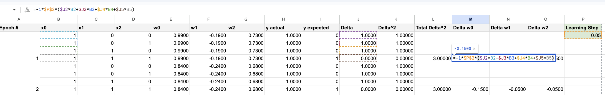

# Perceptron Learning Algorithms: Manual Calculations & Analysis

This repository contains a comprehensive comparison of two fundamental perceptron learning algorithms: **Standard Perceptron (Batch Size = 1)** and **Batch Gradient Descent (Batch Size = 4)**. The work demonstrates manual weight calculations for the logical AND gate dataset using spreadsheet implementations.

## 📋 Table of Contents
- [Overview](#overview)
- [Repository Contents](#repository-contents)
- [Dataset: AND Gate](#dataset-and-gate)
- [Approach 1: Standard Perceptron (Batch Size = 1)](#approach-1-standard-perceptron-batch-size--1)
- [Approach 2: Batch Gradient Descent (Batch Size = 4)](#approach-2-batch-gradient-descent-batch-size--4)
- [Comparative Analysis](#comparative-analysis)
- [Key Findings](#key-findings)
- [Conclusion](#conclusion)

---

## 🎯 Overview

This project explores two different perceptron training methodologies by manually calculating weight updates for the AND gate problem. The comparison highlights the differences in convergence behavior, computational efficiency, and decision boundary formation between online learning (batch=1) and batch learning (batch=4) approaches.

**Learning Goal**: Understand how batch size affects the learning dynamics, convergence speed, and stability of perceptron algorithms.

---

## 📁 Repository Contents

### PDF Documentation
- [Manual Calculation of Weights for Gate And Data Set - Standard Perceptron (Batch size = 1).pdf](file:///Users/alienspirit/Documents/25D/L29_HomeWork/Manual%20Calculation%20of%20Weights%20for%20Gate%20And%20Data%20Set%20-%20Standard%20Perceptron%20(Batch%20size%20=%201).pdf) - Complete spreadsheet calculations for the standard perceptron approach
- [Manual Calculation of Weights for Gate And Data Set - Batch Gradient Descent (Batch size = 4).pdf](file:///Users/alienspirit/Documents/25D/L29_HomeWork/Manual%20Calculation%20of%20Weights%20for%20Gate%20And%20Data%20Set%20-%20Batch%20Gradient%20Descent%20(Batch%20size%20=%204).pdf) - Complete spreadsheet calculations for the batch gradient descent approach

### Images
All formula screenshots and decision boundary visualizations are displayed inline in their respective sections below.

---

## 📊 Dataset: AND Gate

The logical AND gate serves as our training dataset with 4 samples:

| x₀ | x₁ | x₂ | y (Target) |
|----|----|----|-----------:|
| 1  | 0  | 0  | 0          |
| 1  | 0  | 1  | 0          |
| 1  | 1  | 0  | 0          |
| 1  | 1  | 1  | 1          |

**Note**: x₀ is the bias input and is always equal to 1 for all samples.

**Initial Conditions:**
- Weight vector: **w = [w₀, w₁, w₂] = [0, 0, 0]** (w₀ is the bias weight)
- Learning rate: **η = 0.1**
- Activation function: Step function (threshold at 0)

---

## 🔄 Approach 1: Standard Perceptron (Batch Size = 1)

### Methodology

The **Standard Perceptron Algorithm** updates weights after processing each individual training example. This is an **online learning** approach.

### Algorithm Steps

1. **Forward Pass**: For each sample (x₁, x₂, y):
   - Calculate weighted sum: `z = w₀ + w₁x₁ + w₂x₂`
   - Apply step function: `ŷ = 1 if z ≥ 0, else 0`

2. **Error Calculation**: 
   ```
   error = y - ŷ
   ```

3. **Weight Update** (performed immediately after each sample):
   ```
   w₀ = w₀ + η × error × x₀
   w₁ = w₁ + η × error × x₁
   w₂ = w₂ + η × error × x₂
   ```

### Spreadsheet Implementation

The spreadsheet tracks:
- **Input columns**: x₀, x₁, x₂, y_target
- **Computation columns**: weighted_sum, y_predicted, error
- **Weight tracking**: w₀, w₁, w₂ (updated after each row)

### Key Formulas

````carousel

<!-- slide -->

<!-- slide -->

<!-- slide -->

<!-- slide -->

````

### Results & Decision Boundary

.png)

**Characteristics:**
- ✅ **Rapid updates**: Weights change after every sample
- ✅ **Quick initial progress**: Immediately responds to misclassifications
- ⚠️ **Potential instability**: Can oscillate between solutions
- ⚠️ **Noisier convergence**: More erratic weight trajectory

---

## 📈 Approach 2: Batch Gradient Descent (Batch Size = 4)

### Methodology

**Batch Gradient Descent** processes all training samples before updating weights. This is a **batch learning** approach that computes the average gradient over the entire dataset.

### Algorithm Steps

1. **Forward Pass** (for all samples):
   - Calculate predictions for all 4 samples
   - Store individual errors

2. **Error Accumulation**:
   - Compute delta for each sample: `Δ = ŷ - y` (predicted minus actual)
   - Sum all deltas: `Σ(Δᵢ × xᵢ)`

3. **Batch Weight Update** (once per epoch):
   ```
   w₀ = w₀ - η × Σ(Δᵢ × x₀_i) / N
   w₁ = w₁ - η × Σ(Δᵢ × x₁_i) / N
   w₂ = w₂ - η × Σ(Δᵢ × x₂_i) / N
   ```
   Where `Δᵢ = ŷᵢ - yᵢ` (note the negative sign in the update rule)
   Where N = 4 (batch size)

4. **Error Metric**:
   - Total Error (Sum of Squared Deltas): `Total Error = Σ(Δᵢ)² = Σ(ŷᵢ - yᵢ)²`

### Spreadsheet Implementation

The spreadsheet includes:
- **Sample processing**: All 4 samples evaluated with current weights
- **Gradient accumulation**: Delta values summed across all samples
- **Error tracking**: Total Error calculated for each epoch
- **Batch update**: Weights updated once per complete pass

### Key Formulas

````carousel

<!-- slide -->

<!-- slide -->

<!-- slide -->

<!-- slide -->

<!-- slide -->

````

### Results & Decision Boundary

.png)

**Characteristics:**
- ✅ **Stable convergence**: Smooth weight trajectory
- ✅ **Better generalization**: Updates based on overall data pattern
- ✅ **Predictable behavior**: Consistent gradient direction
- ⚠️ **Slower initial progress**: Requires full pass before any update
- ⚠️ **Memory requirements**: Stores all samples and errors

---

## 🔬 Comparative Analysis

### **1. Update Frequency**

| Aspect | Standard Perceptron (Batch=1) | Batch Gradient Descent (Batch=4) |
|--------|-------------------------------|-----------------------------------|
| **Updates per epoch** | 4 updates | 1 update |
| **Feedback speed** | Immediate | Delayed until full pass |
| **Computational overhead** | Low per sample | Higher per epoch |

### **2. Learning Dynamics**

| Characteristic | Batch Size = 1 | Batch Size = 4 |
|----------------|----------------|----------------|
| **Convergence path** | Zigzag, reactive | Smooth, averaged |
| **Stability** | Can oscillate | More stable |
| **Sensitivity to noise** | High | Low (averaging effect) |
| **Risk of local minima** | Can jump out | Can get stuck |

### **3. Computational Efficiency**

```diff
Standard Perceptron (Batch=1):
+ Minimal memory requirements
+ Simple to implement
+ Fast per-sample processing
- More total iterations may be needed
- Unstable in noisy datasets

Batch Gradient Descent (Batch=4):
+ Stable, consistent updates
+ Better for parallel computation
+ Clearer error trends (Total Error tracking)
- Requires storing all samples
- Slower to respond to individual errors
```

### **4. Practical Considerations**

| Use Case | Recommended Approach | Reason |
|----------|---------------------|---------|
| **Small dataset (like AND gate)** | Batch GD | All data fits in memory |
| **Large dataset** | Mini-batch or SGD | Memory constraints |
| **Online learning** | Standard Perceptron | Real-time updates needed |
| **Noisy data** | Batch GD | Averaging reduces noise impact |
| **Need quick initial results** | Standard Perceptron | Immediate weight updates |

---

## 🎓 Key Findings

### From Spreadsheet Analysis

1. **Convergence Behavior**:
   - Both approaches successfully learned the AND gate function
   - Standard Perceptron showed more weight fluctuations
   - Batch GD demonstrated smoother error reduction

2. **Decision Boundary Quality**:
   - Both produced valid linear separators
   - Final boundaries were similar but reached via different paths
   - Batch GD boundary may be more centered/generalized

3. **Learning Efficiency**:
   - Standard Perceptron: Faster initial corrections
   - Batch GD: More efficient use of computational resources per epoch

4. **Error Tracking**:
   - Standard Perceptron: Binary error (correct/incorrect)
   - Batch GD: Continuous MSE metric provides better progress visibility

### Theoretical Insights

> [!IMPORTANT]
> **The Bias-Variance Tradeoff**
> 
> - **Batch Size = 1**: High variance, low bias - highly responsive but unstable
> - **Batch Size = 4**: Lower variance, slight bias - stable but potentially slower

> [!TIP]
> **Real-World Recommendation**
> 
> For most practical applications, **mini-batch gradient descent** (batch size between 1 and full dataset) offers the best of both worlds:
> - Computational efficiency through vectorization
> - Noise reduction from averaging
> - Regular weight updates for faster convergence

---

## 📌 Conclusion

This manual implementation exercise demonstrates that:

1. **Both algorithms work** for linearly separable problems like the AND gate
2. **Batch size is a critical hyperparameter** affecting:
   - Convergence speed
   - Solution stability
   - Computational requirements
   - Generalization ability

3. **Standard Perceptron (Batch=1)** excels in:
   - Simplicity of implementation
   - Speed of initial learning
   - Online/streaming data scenarios

4. **Batch Gradient Descent (Batch=4)** excels in:
   - Stability and reproducibility
   - Noise robustness
   - Vectorization opportunities

5. **The choice depends on context**:
   - Dataset size
   - Computational resources
   - Learning requirements (online vs. offline)
   - Desired stability vs. adaptability

### Next Steps

To deepen understanding, consider:
- Implementing with larger datasets (e.g., OR, XOR gates)
- Experimenting with different learning rates
- Testing mini-batch sizes (e.g., batch=2)
- Comparing convergence speed across multiple runs
- Implementing momentum or adaptive learning rates

---

## 📚 References

### Source Spreadsheet
- [View Live Google Spreadsheet](https://docs.google.com/spreadsheets/d/1BKUrcsTytChlI2XbUrhIfRit84eqW9j-VHDCvOnI0-o/edit?gid=0#gid=0) - Interactive version with all calculations and formulas

### Spreadsheet Work (PDF Exports)
- [Standard Perceptron Calculations (PDF)](file:///Users/alienspirit/Documents/25D/L29_HomeWork/Manual%20Calculation%20of%20Weights%20for%20Gate%20And%20Data%20Set%20-%20Standard%20Perceptron%20(Batch%20size%20=%201).pdf)
- [Batch Gradient Descent Calculations (PDF)](file:///Users/alienspirit/Documents/25D/L29_HomeWork/Manual%20Calculation%20of%20Weights%20for%20Gate%20And%20Data%20Set%20-%20Batch%20Gradient%20Descent%20(Batch%20size%20=%204).pdf)

### Visualizations
All decision boundaries and formula screenshots are available in this repository.

